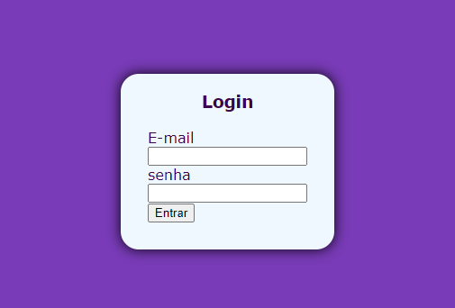

# Projeto - Login
 
Projeto criado como parte avaliativa da disciplina de Fundamentos de Desenvolvimento Web ministrada pelo professor Leonardo Rocha.
 
## Índice
* [Descrição](#descrição)
* [Tecnologias](#tecnologias)
* [Referências](#referências)
* [Autor(a)](#autora)
 
## Descrição
 
Um projeto para criar uma página de login com linguagens de HTML e CSS.
 
 
## Tecnologias
 
* HTML5
* CSS3
* Git
* Github
 
## Códigos
 
* background-color - Propriedade CSS que define cor de fundo de um elemento.
 
* padding - A propriedade padding define uma a distância entre o conteúdo de um elemento e suas bordas.
 
* height - A propriedade height do CSS determina a altura da área do conteúdo de um elemento.
 
* justify-content - A propriedade justify-content é usada para alinhar os elementos
 
* align-items - Alinha os itens do grupo dependendo do função que você inserir no comando, neste projeto usamos o "center".
 
* font family - A propriedade font-family do CSS permite que se faça uma lista de prioridades de familias de fontes e/ou nomes genéricos de famílias a serem especificados para um elemento selecionado.
 
* display - A propriedade display CSS define se um elemento é tratado como um bloco ou elemento inline e o layout usado para seus filhos, como layout de fluxo, grid ou flex.
 
* width - A propriedade CSS width determina a largura da área de conteúdo de um elemento. A área de conteúdo fica dentro do preenchimento, da borda, e da margem de um elemento.
 
* height - A propriedade height do CSS determina a altura da área do conteúdo de um elemento. A área de conteúdo consiste no padding, margin e border do elemento.
 
* border-radius - A propriedade CSS3 border-radius destina-se a definir bordas arredondadas.
 
* box-shadow - O box-shadow é uma propriedade do CSS, é utilizado para adicionar efeitos de sombra em volta de um elemento. Você pode especificar mais de um efeito, os separando com virgulas.
 
* text-aling - A propriedade CSS text-align descreve como conteúdo inline, como texto, é alinhado no elemento pai em bloco. text-align não controla o alinhamento de elementos em bloco, apenas o seu conteúdo inline.
 
## Resultado Final
 

 
## Referências
 
* [Alura](https://www.alura.com.br/artigos/escrever-bom-readme) - Como escrever um README incrivel no seu gitHub
* [MDN](https://developer.mozilla.org/pt-BR/) - Usado para uma pesquisa aprofundada dos itens de CSS e HTML.
* [AleloWiki](https://alelowiki.cenargen.embrapa.br/index.php/P%C3%A1gina_principal) - Site usado na pesquisa do código CSS "justify-content".
* [Maujor](https://maujor.com/) - Site usado na pesquisa do código CSS "border-radius".
 
## Autor(a)
 
Projeto desenvolvido pela aluna:
* Brenda peitl gomes